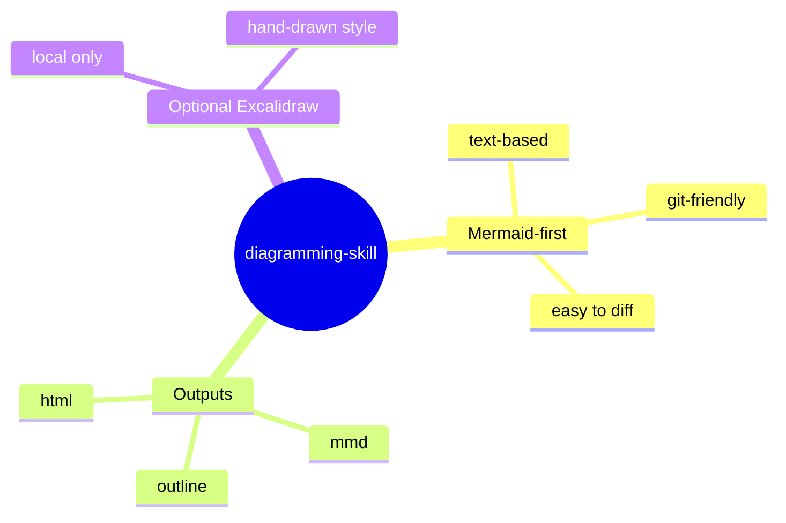

# diagramming-skill

[](./LICENSE)
[](https://github.com/CtriXin/diagramming-skill/tags)

Mermaid-first diagramming skill for Codex and Claude. It creates practical local outputs for diagrams and mind maps: `*.mmd`, `*-outline.md`, and browser-openable `*.html`.

Suggested GitHub description:

`Mermaid-first diagramming skill for Codex and Claude, with local mmd + outline + html outputs.`

[中文文档](./README.zh-CN.md)

## Why

Most AI drawing flows break in one of these places:

- the client does not render inline widgets
- the output is visual only and cannot be diffed
- the diagram has no accompanying text explanation
- Excalidraw links are shareable but not durable enough for repo workflows

This skill fixes that by defaulting to a text-first workflow.

## Default Workflow

1. Use `Mermaid` first
2. Generate a matching `outline.md`
3. Generate a local `html` preview
4. Use local `Excalidraw` only when the user explicitly wants a hand-drawn style

## Outputs

For each diagram, the default bundle is:

- `name.mmd`
- `name-outline.md`
- `name.html`

## Example Diagram

GitHub can render Mermaid blocks directly:



## Example Files

See [`examples/`](./examples/):

- [`examples/mermaid-intro.mmd`](./examples/mermaid-intro.mmd)
- [`examples/mermaid-intro-outline.md`](./examples/mermaid-intro-outline.md)
- [`examples/mermaid-intro.html`](./examples/mermaid-intro.html)
- [`examples/hive-discuss-structure.mmd`](./examples/hive-discuss-structure.mmd)
- [`examples/hive-discuss-structure-outline.md`](./examples/hive-discuss-structure-outline.md)
- [`examples/hive-discuss-structure.html`](./examples/hive-discuss-structure.html)

## Quick Start

### Generate a local diagram bundle

```bash
python3 scripts/create_diagram_bundle.py \
  --title "My Diagram" \
  --slug my-diagram \
  --diagram examples/mermaid-intro.mmd \
  --outline examples/mermaid-intro-outline.md \
  --output-dir ./tmp/diagrams
```

### Generate HTML from Mermaid only

```bash
python3 scripts/render_mermaid_html.py \
  examples/mermaid-intro.mmd \
  ./tmp/diagrams/mermaid-intro.html \
  --title "Mermaid Intro"
```

## Install As a Skill

### Codex

```bash
ln -s /path/to/diagramming-skill ~/.codex/skills/diagramming
```

### Claude

```bash
ln -s /path/to/diagramming-skill ~/.claude/skills/diagramming
```

## Trigger Phrases

Typical Chinese trigger phrases:

- `帮我画个结构图`
- `帮我画个脑图`
- `画个脑图`
- `画个关系图`

## Repository Layout

```text
diagramming-skill/
├── README.md
├── README.zh-CN.md
├── LICENSE
├── SKILL.md
├── CLAUDE.md
├── examples/
├── scripts/
└── agents/
```

## Notes

- This repository is intentionally text-first.
- Inline widget rendering is optional, not required.
- `Excalidraw remote` is not the default path.
- See [`CHANGELOG.md`](./CHANGELOG.md) for release history.
- See [`CONTRIBUTING.md`](./CONTRIBUTING.md) for contribution guidance.
