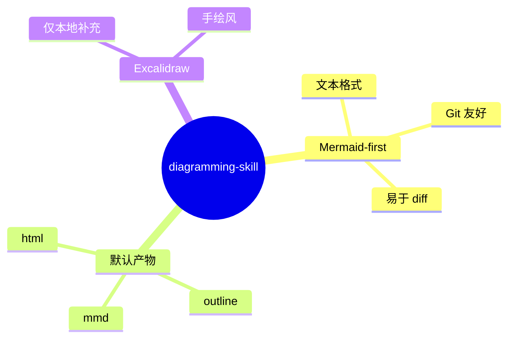

# diagramming-skill

一个给 `Codex` 和 `Claude` 共用的画图 skill，默认走 `Mermaid`，并产出适合本地保存和版本管理的三件套：`*.mmd`、`*-outline.md`、`*.html`。

建议 GitHub description：

`Mermaid-first diagramming skill for Codex and Claude, with local mmd + outline + html outputs.`

[English README](./README.md)

## 为什么做这个 skill

很多 AI 画图链路的问题都很像：

- 客户端不一定能渲染内嵌图
- 最终只剩一张图，没有文本说明
- 图不能进 Git，很难 diff
- 在线白板链接适合临时分享，但不适合长期沉淀

这个 skill 的做法是：**默认文本优先，而不是渲染优先。**

## 默认工作流

1. 先用 `Mermaid`
2. 补一个对应的 `outline.md`
3. 生成本地可打开的 `html`
4. 只有用户明确要手绘感时，才走本地 `Excalidraw`

## 默认产物

每张图默认交付：

- `name.mmd`
- `name-outline.md`
- `name.html`

## 示例图

GitHub 本身就能直接渲染 Mermaid：



## 示例文件

见 [`examples/`](./examples/)：

- [`examples/mermaid-intro.mmd`](./examples/mermaid-intro.mmd)
- [`examples/mermaid-intro-outline.md`](./examples/mermaid-intro-outline.md)
- [`examples/mermaid-intro.html`](./examples/mermaid-intro.html)
- [`examples/hive-discuss-structure.mmd`](./examples/hive-discuss-structure.mmd)
- [`examples/hive-discuss-structure-outline.md`](./examples/hive-discuss-structure-outline.md)
- [`examples/hive-discuss-structure.html`](./examples/hive-discuss-structure.html)

## 快速开始

### 生成本地三件套

```bash
python3 scripts/create_diagram_bundle.py \
  --title "My Diagram" \
  --slug my-diagram \
  --diagram examples/mermaid-intro.mmd \
  --outline examples/mermaid-intro-outline.md \
  --output-dir ./tmp/diagrams
```

### 只把 Mermaid 变成 HTML

```bash
python3 scripts/render_mermaid_html.py \
  examples/mermaid-intro.mmd \
  ./tmp/diagrams/mermaid-intro.html \
  --title "Mermaid Intro"
```

## 安装成 Skill

### Codex

```bash
ln -s /path/to/diagramming-skill ~/.codex/skills/diagramming
```

### Claude

```bash
ln -s /path/to/diagramming-skill ~/.claude/skills/diagramming
```

## 典型触发词

- `帮我画个结构图`
- `帮我画个脑图`
- `画个脑图`
- `画个关系图`

## 仓库结构

```text
diagramming-skill/
├── README.md
├── README.zh-CN.md
├── LICENSE
├── SKILL.md
├── CLAUDE.md
├── examples/
├── scripts/
└── agents/
```

## 说明

- 这个仓库刻意采用“文本优先”的画图策略
- 聊天界面的内嵌渲染不是必须条件
- `Excalidraw remote` 不是默认路径
